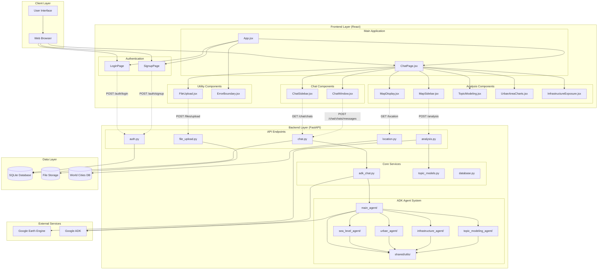
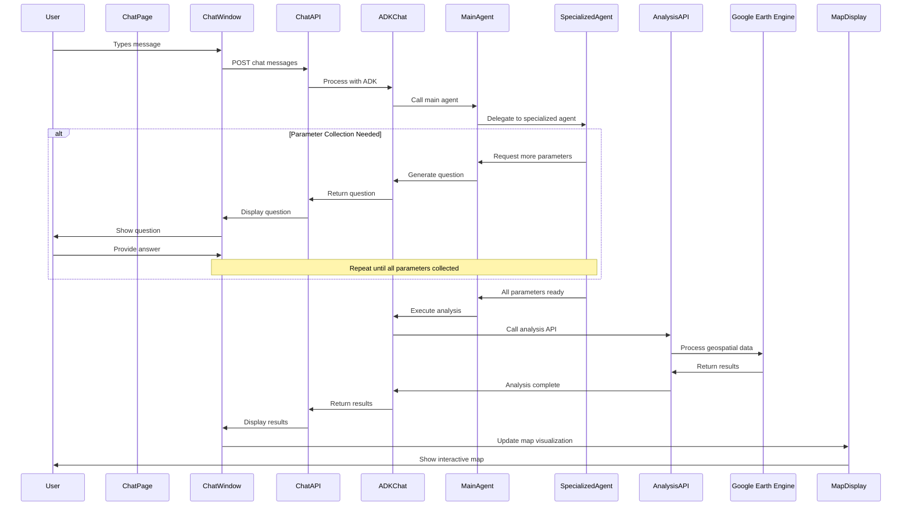
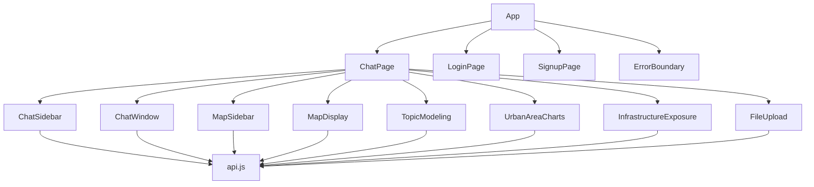
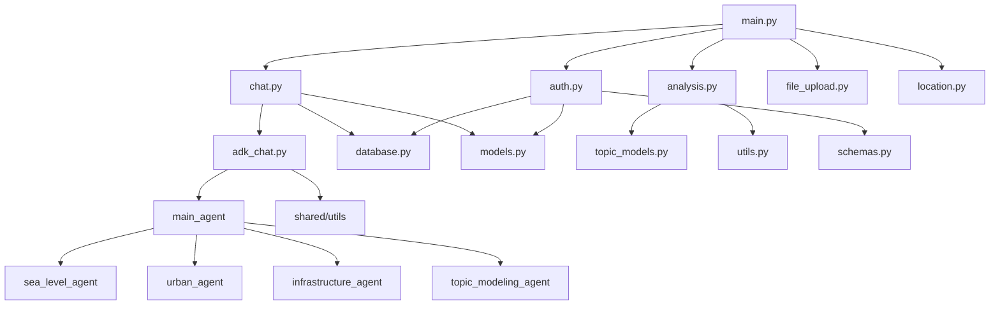

# DataGround Component Relationship Diagram

## System Architecture Overview

## Data Flow Diagram

## Component Dependencies

### Frontend Dependencies

### Backend Dependencies

## Key Integration Points

### 1. ADK Agent Integration
- **Entry Point**: `adk_chat.py` receives user messages
- **Coordination**: `main_agent` coordinates conversation flow
- **Specialization**: Domain-specific agents handle analysis types
- **Parameter Collection**: Interactive parameter gathering through conversation

### 2. Analysis Pipeline
- **Input**: User parameters from ADK agents
- **Processing**: Google Earth Engine for geospatial analysis
- **Topic Modeling**: LDA/BERTopic for document analysis
- **Output**: Interactive visualizations and charts

### 3. Data Persistence
- **User Management**: Authentication and user profiles
- **Chat History**: Persistent conversation storage
- **File Storage**: Uploaded documents and datasets
- **Location Data**: World cities database for geocoding

### 4. Real-time Communication
- **WebSocket**: Real-time chat updates (if implemented)
- **API Polling**: Regular updates for analysis progress
- **State Management**: React state for UI updates
- **Error Handling**: Comprehensive error boundaries and logging
