# DataGround Project Structure

## Overview
DataGround is a geospatial analytics platform featuring an AI assistant with Google ADK agents, interactive map visualizations, and comprehensive data analysis capabilities.

## Architecture Diagram

```mermaid
graph TB
    subgraph "Frontend (React + Vite)"
        A[App.jsx] --> B[LoginPage.jsx]
        A --> C[SignupPage.jsx]
        A --> D[ChatPage.jsx]
        D --> E[ChatSidebar.jsx]
        D --> F[ChatWindow.jsx]
        D --> G[MapSidebar.jsx]
        D --> H[MapDisplay.jsx]
        D --> I[TopicModeling.jsx]
        D --> J[UrbanAreaCharts.jsx]
        D --> K[InfrastructureExposure.jsx]
        D --> L[FileUpload.jsx]
    end

    subgraph "Backend (FastAPI)"
        M[main.py] --> N[auth.py]
        M --> O[chat.py]
        M --> P[analysis.py]
        M --> Q[file_upload.py]
        M --> R[location.py]
        M --> S[adk_chat.py]
        M --> T[topic_models.py]
    end

    subgraph "ADK Agents System"
        S --> U[main_agent/]
        S --> V[sea_level_agent/]
        S --> W[urban_agent/]
        S --> X[infrastructure_agent/]
        S --> Y[topic_modeling_agent/]
        U --> Z[shared/utils/]
        V --> Z
        W --> Z
        X --> Z
        Y --> Z
    end

    subgraph "Database"
        AA[SQLite Database]
        BB[User Model]
        CC[Chat Model]
        DD[Message Model]
        AA --> BB
        AA --> CC
        AA --> DD
    end

    subgraph "External Services"
        EE[Google Earth Engine]
        FF[Google ADK]
        GG[World Cities Database]
    end

    subgraph "Data Storage"
        HH[uploaded_files/]
        II[worldcities.csv]
    end

    %% Frontend to Backend connections
    A -.->|API Calls| M
    D -.->|Chat API| O
    D -.->|Analysis API| P
    D -.->|File Upload| Q
    D -.->|Location API| R

    %% Backend to Database
    N --> AA
    O --> AA
    P --> AA

    %% Backend to External Services
    P --> EE
    S --> FF
    R --> GG

    %% Backend to Data Storage
    Q --> HH
    R --> II

    %% ADK Integration
    S -.->|Agent Calls| U
    S -.->|Agent Calls| V
    S -.->|Agent Calls| W
    S -.->|Agent Calls| X
    S -.->|Agent Calls| Y
```



## Detailed Component Structure

### Frontend Components
```
frontend/src/
├── App.jsx                    # Main app router and authentication
├── api.js                     # API client functions
├── main.jsx                   # React entry point
├── index.css                  # Global styles
└── components/
    ├── ChatPage.jsx           # Main chat interface with 3-panel layout
    ├── ChatSidebar.jsx        # Chat history sidebar
    ├── ChatWindow.jsx         # Chat input/output window
    ├── MapSidebar.jsx         # Analysis parameters sidebar
    ├── MapDisplay.jsx         # Interactive map with Leaflet
    ├── TopicModeling.jsx      # Topic modeling visualization
    ├── UrbanAreaCharts.jsx    # Urban area analysis charts
    ├── UrbanAreaComprehensiveCharts.jsx # Comprehensive urban charts
    ├── InfrastructureExposure.jsx # Infrastructure analysis
    ├── FileUpload.jsx         # File upload component
    ├── LoginPage.jsx          # User login
    ├── SignupPage.jsx         # User registration
    └── ErrorBoundary.jsx      # Error handling
```

### Backend Structure
```
backend/app/
├── main.py                    # FastAPI entry point and routing
├── database.py                # Database connection and session
├── models.py                  # SQLAlchemy models (User, Chat, Message)
├── schemas.py                 # Pydantic schemas
├── auth.py                    # Authentication endpoints
├── chat.py                    # Chat management endpoints
├── analysis.py                # Google Earth Engine analysis
├── file_upload.py             # File upload handling
├── location.py                # Location/city data endpoints
├── adk_chat.py                # Google ADK integration
├── topic_models.py            # Topic modeling (LDA/BERTopic)
├── utils.py                   # Utility functions
└── adk_geospatial_agents/     # ADK Agent System
    ├── main_agent/            # Main coordinator agent
    ├── sea_level_agent/       # Sea level rise analysis
    ├── urban_agent/           # Urban area analysis
    ├── infrastructure_agent/  # Infrastructure exposure
    ├── topic_modeling_agent/  # Topic modeling
    └── shared/                # Shared utilities
        ├── tools/             # Common tools
        └── utils/             # Common utilities
```

## Key Features

### 1. AI Assistant with ADK Agents
- **Main Agent**: Coordinates conversation and parameter collection
- **Specialized Agents**: Handle specific analysis types
- **Natural Language Processing**: Converts user requests to analysis parameters
- **Parameter Collection**: Interactive parameter gathering through conversation

### 2. Geospatial Analysis
- **Sea Level Rise Risk**: Analyze coastal flooding risks
- **Urban Area Analysis**: Track urban expansion over time
- **Infrastructure Exposure**: Assess infrastructure vulnerability
- **Interactive Maps**: Real-time visualization with Leaflet

### 3. Topic Modeling
- **LDA**: Traditional topic modeling with user-defined topics
- **BERTopic**: Advanced topic modeling with automatic topic detection
- **File Support**: PDF, DOCX, TXT file processing
- **Visualization**: Word clouds and topic distribution charts

### 4. Data Management
- **User Authentication**: Secure login/signup system
- **Chat History**: Persistent conversation storage
- **File Upload**: Support for various document formats
- **Location Database**: Comprehensive world cities database

## Technology Stack

### Frontend
- **React 18**: UI framework
- **Vite**: Build tool and dev server
- **Material-UI**: Component library
- **React Router**: Client-side routing
- **Leaflet**: Interactive maps
- **Recharts**: Data visualization
- **Axios**: HTTP client

### Backend
- **FastAPI**: Web framework
- **SQLAlchemy**: ORM
- **SQLite**: Database
- **Google ADK**: Agent framework
- **Google Earth Engine**: Geospatial analysis
- **Pydantic**: Data validation
- **JWT**: Authentication

### Analysis & ML
- **scikit-learn**: LDA topic modeling
- **BERTopic**: Advanced topic modeling
- **NumPy/Pandas**: Data processing
- **Matplotlib**: Plotting
- **WordCloud**: Text visualization

## Data Flow

1. **User Input**: User types message in chat interface
2. **ADK Processing**: Main agent processes natural language
3. **Parameter Collection**: Specialized agents collect analysis parameters
4. **Analysis Execution**: Backend calls appropriate analysis functions
5. **Data Processing**: Google Earth Engine or topic modeling processes data
6. **Visualization**: Results displayed in interactive maps/charts
7. **Storage**: Chat history and results saved to database

## Security & Authentication

- **JWT Tokens**: Secure user authentication
- **Password Hashing**: bcrypt for password security
- **CORS**: Configured for cross-origin requests
- **Input Validation**: Pydantic schemas for data validation
- **Error Handling**: Comprehensive error boundaries and logging
